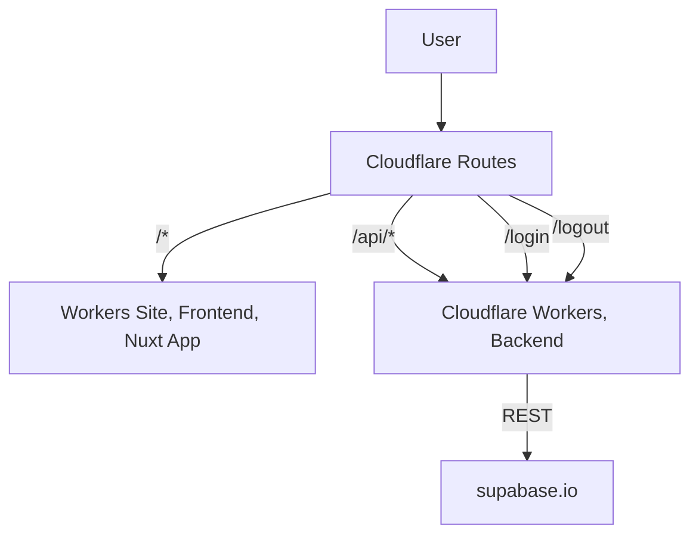

# ISUCON11本選問題のアプリケーションをCloudflare WorkersとSupabaseで実装してみる

このリポジトリは実践的なウェブアプリケーションをCloudflare Workers上で動作させ、そのアーキテクチャ特性を検証するという目的で作られました。

## アーキテクチャ

## アプリケーションについて
https://isucon.net/archives/56163308.html

## ISUCON11について
https://isucon.net/archives/55821036.html

## フロントエンド実装
https://github.com/isucon/isucon11-final/tree/main/webapp/frontend
をそのまま利用します

## データベースについて
Supabaseを利用する制約上、MySQLからPostgreSQLに置き換えています

# 感謝
https://github.com/isucon/isucon11-final/tree/main/webapp/nodejs 
のNode.js版参考実装に沿って開発しています

https://github.com/remix-run/remix/ 
から多くのプラクティスを取り入れました
